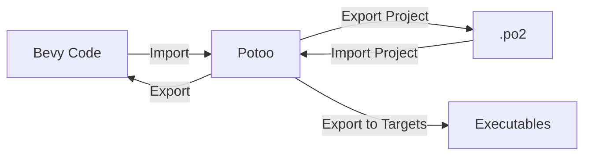
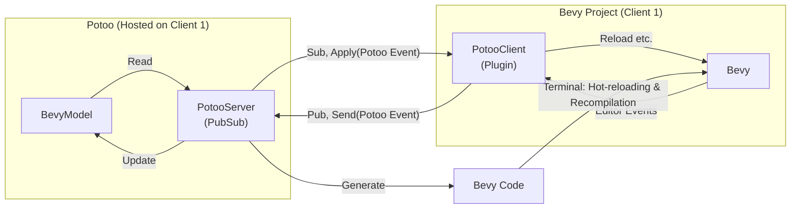

# Potoo 👻🐦

<div align="center">
<a href="https://crates.io/crates/potoo"></a>
<a href="https://docs.rs/potoo"></a>
<a href="https://github.com/BlackPhlox/potoo/blob/main/LICENSE-APACHE"></a>
<a href="https://crates.io/crates/potoo"></a>   
<a href="https://github.com/BlackPhlox/potoo"></a>
<a href="https://github.com/BlackPhlox/potoo/actions/workflows/ci.yml"></a>
<a href="https://github.com/bevyengine/bevy/tree/latest"></a>
</div><br>

The Cursed Editor for [Bevy](https://bevyengine.org).

Started as [bevy_cursed_editor](https://github.com/BlackPhlox/bevy_cursed_editor), Potoo is an experimental, code-first game editor that helps you create and modify games, apps, bevy plugins, and examples.

⚠ **Feedback** - _Potoo is at a very early stage so any and all feedback is highly appreciated_ ⚠

What sets Potoo apart from other editors is its ability to import and export to Bevy code, freeing developers from dependency to Potoo. With Potoo, you can modify runtime-systems on the fly using hot-reloading, making game development a seamless and enjoyable experience.



Potoo is still in a very experimental prototype phase of development, but we're excited about the possibilities it offers for game development in Bevy. Try it out and [let us know what you think](https://github.com/BlackPhlox/potoo/issues/new)! 

# Planned features

## User Interface
Potoo is using [bevy_editor_pls](https://github.com/jakobhellermann/bevy_editor_pls) ([egui](https://github.com/emilk/egui)) for the ui and is dependent on that bevy_editor_pls is up-to-date with egui's updates and latest functionality. In the future, potoo might use bevy_egui directly for faster development and usages of egui features.

</br>
Potoo is focusing on getting the [bevy_editor_pls](https://github.com/jakobhellermann/bevy_editor_pls) ([egui](https://github.com/emilk/egui)) dependency working for bevy `0.10` and hot-reloading with the editor.

## Import & Export
Exports to all platforms: With Potoo, you can easily export your games to all types of platforms, making it possible to reach a wide range of audiences. While minimizing the executable size.

`bevy_codegen` is the project continued from [bevy_cursed_editor](https://github.com/BlackPhlox/bevy_cursed_editor) which contains the import functionality using `syn` (See [parse.rs](/bevy_codegen/src/parse.rs)) and export part from [generate.rs](/bevy_codegen/src/generate.rs).

Project files will be saved as `.po2` as an underlying json format, which can be changed as `serde` is used. When the BevyModel reaches version `1.0`, the export will include version check for compatibility and auto-conversion.

### Import
</br>
Using syn to parse rust code to bevy is takes a long time to program. So progress can be followed by looking in the [parse_bevy](/examples/parse_bevy.rs) example.

### Export
</br>
Can be exported into `.po2`. However, there is yet no support for backwards compatibility implemented, so a version `1.0` of the format is first defined when backwards compatibility can be assure and a upgrade path can be made. See [automated-upgrade-path](#automated-upgrade-path) for status on this.

## Bootstrapping Bevy - _Hit the ground running_
Potoo is an application that bootstraps itself to a bevy project, allowing you to start your game development process with ease. The format is flexible which allows for creating and modifying games, apps, Bevy plugins, and even examples using Potoo.


Currently, the bootstrapping is not encompassing enough to be declared complete. Also, using [cargo-make](https://github.com/sagiegurari/cargo-make) might be a much better alternative to using `std::process::Command`, with the exception of std vs. +1 external binary dependency like `cargo-watch`.

## Hot-reloading of systems
Potoo allows you to modify runtime-systems in real-time, without having to restart the game. This can save you a lot of time during development, as you can iterate on your game logic quickly and see the changes in real-time.

Some things like data structures cannot be changed during hot-reloading runtime, `potoo` knows this and only reloads your entire application when required, to reduce friction for the user.

To achieve hot-reloading, potoo uses [hot-lib-reloader](https://github.com/rksm/hot-lib-reloader-rs) with a strategic module setup to maximize hot-reloading support.

</br>
Works as of now, though there is a mismatch with windows vs. linux, windows have to compile system library twice. This extra work is currently also forced unto linux users. Once event structure is finalized work on hot-reloading can continue.

## Undo/redo history
Potoo keeps track of all the changes you make to your game, allowing you to undo or redo any action at any time. This is especially useful when you want to experiment with different game mechanics or revert a mistake you made.

Potoo is saving the full undo and redo history, allowing you to experiment with different approaches without fear of losing progress and giving you the flexibility to experiment with different ideas with realtime updates thanks to hot-reloading.

</br>
Has a strong dependency to potoo events, this and events have to be defined and is yet to be consolidated to work for most common use-cases.

## Automated upgrade path
Bevy is a rapidly evolving game engine, which can sometimes make it challenging to keep up with the latest changes. Potoo aims to simplify this process by automating the upgrade path between Bevy versions. This ensures that your game stays up-to-date with the latest features and bug fixes, without requiring you to manually update your code.

Accommodates for bevy’s rapid development cycle: Potoo is designed to automate the upgrade path, making it easy to keep up with Bevy’s rapid development cycle.

</br>
The format for the BevyModel has to be at version `1.0` (a solid specification) before work can begin on this.

## Real-time collaboration
Potoo uses a publish-subscribe network to enable real-time collaboration between multiple clients. This means that you can work on the same game project with your team, even if you're not in the same location.

</br>
Using mini-redis, a pubsub server is setup to run and respond to published events, see example [http](/examples/http.rs).

## Code Editor
</br>
Using [egui's demo code_editor](https://github.com/emilk/egui/blob/master/crates/egui_demo_lib/src/demo/code_editor.rs), but is looking into auto-open using VSC.

## Level/Scene Editing
</br>
Edit and manage scenes, can be serialized.

## CLI
</br>
To expand default capabilities when compiled to a binary package like:
```sh
# Launches UI version
potoo

# Launches UI version in defined directory
potoo --dir .

# Displays help screen text
potoo --help

# Create a new bevy project called bevy_test
potoo --new bevy_test

# Create a new bevy project types called bevy_test, app is default
potoo --new bevy_test --template app
potoo --new bevy_test --template game
potoo --new bevy_test --template plugin

# Import a bevy project to potoo format -> .po2
potoo --import .

# Export a bevy project to multiple executables, current os is default
potoo --export . --targets ["x86_64-pc-windows-msvc","wasm32-unknown-unknown","armv7-linux-androideabi"]
```

## Automated Testing
</br>
Create a framework based on templates for testing systems to catch errors, such as instantiations check prior to running bevy at runtime.

# How does Potoo work?
The layout of how setup in terms of plugin, client-server and reloading.



# Usage / Getting started

The project is still in such an early stage that currently the main method and accompaning examples is demos of the current progress of the project.

The project has yet to be run using linux and macos, please let us know by creating an issue.

## main

When running the project, the entrypoint/main is currently simulating the process workflow for starting a new project, adding some component in the form of events, exporting the code and running it. The step-by-step is:
- Get default template
- Add some components using undoable events
- Print the different formats
- Project and code generaetion
- Generate .po2 file
- Parse file
- Build and run the generated project and code

This can be done by cloning the project and calling the command:
```
cargo r
```

## http
```
cargo r --example http
```

## parse_bevy
```
cargo r --example parse_bevy
```

# Thanks and Alternatives

- [bevy_editor_pls](https://github.com/jakobhellermann/bevy_editor_pls) - Get editor like ui for your bevy project, also used in this project.
- [bevy-remote-devtools](https://github.com/reneeichhorn/bevy-remote-devtools) - Browser UI for debugging bevy projects.
- [bevy-yoleck](https://github.com/idanarye/bevy-yoleck) - Turn a bevy game into a level editor.
- [bevy_game_template](https://github.com/NiklasEi/bevy_game_template) - A general template for a bevy game.

## Editor Experiments

- [blender_bevy_toolkit](https://github.com/sdfgeoff/blender_bevy_toolkit)
- [DGriffin91's Ridiculous bevy hot reloading](https://github.com/DGriffin91/ridiculous_bevy_hot_reloading)
- [bevy_plugin_analyzer](https://github.com/atbentley/bevy_plugin_analyzer)
- [SneakyBerry's Bevy Editor](https://github.com/SneakyBerry)
- [rewin123's space_editor](https://github.com/rewin123/space_editor)

# Licensing
The project is under dual license MIT and Apache-2.0

# Contributing
If you're interested in contributing to Potoo, we welcome and value your input and contributions! 
